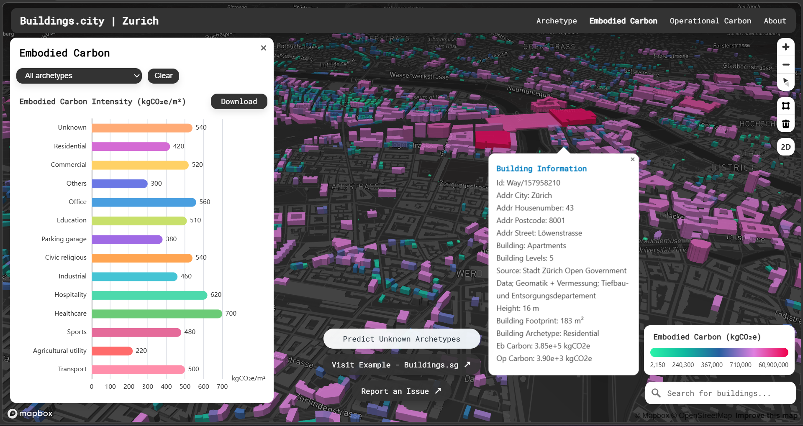
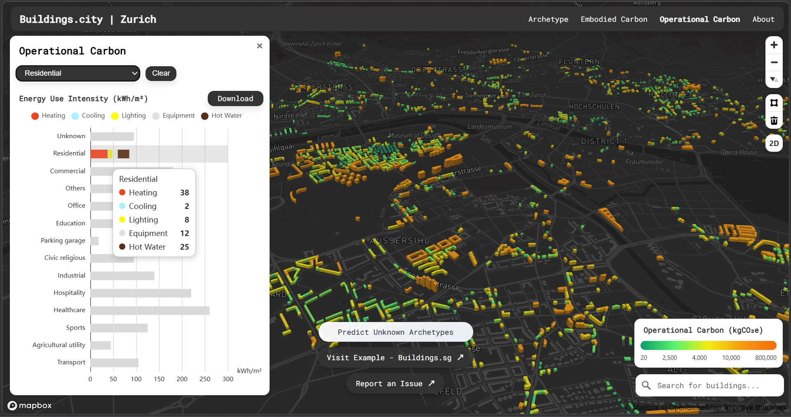
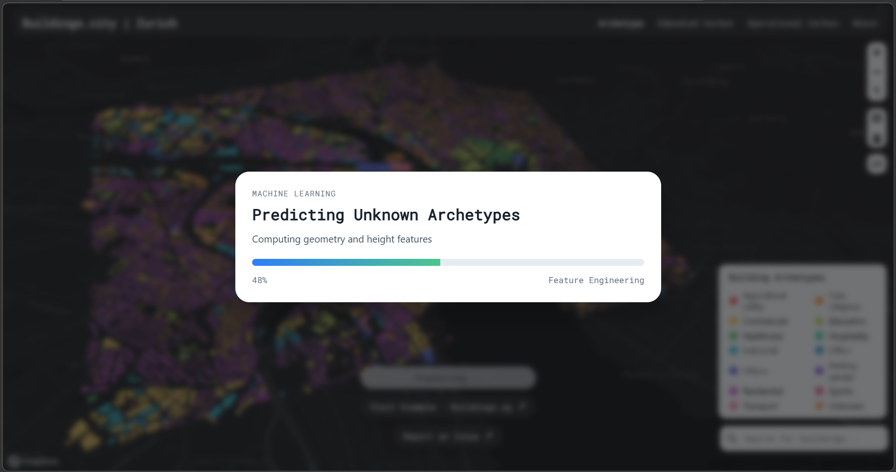

# Buildings.city

Buildings.city is a lightweight toolkit developed through Buildings.sg to help cities quickly build interactive Urban Building Energy Modeling (UBEM) platforms using their own building data. Through a simple configuration system and GeoJSON datasets, the package enables cities and researchers to visualize urban buildings, explore energy-related information, and communicate city-scale building data through an interactive map interface.

In addition to data visualization, the platform can support basic workflows for operational carbon and embodied carbon analysis by connecting user-provided datasets or simulation results. Buildings.city was initially developed as part of a research effort to lower the technical barrier for deploying urban energy platforms and can be adapted by cities and research teams using their own data. For implementation guidance, please refer to the Documentation or explore the Open-source Package.

This repository can also be paired with the optional Python service under `ml-service/` to classify `unknown` building archetypes directly from user GeoJSON files. The frontend sends the GeoJSON to the local service, which extracts geometry-derived features, trains a random-forest classifier from the already labeled buildings, and returns predictions, probabilities, metrics, and feature importance.

In the UI, this workflow is exposed through the **Predict Unknown Archetypes** action. When triggered, the app sends the active GeoJSON to the ML backend, receives inferred labels for unknown buildings, and updates the in-memory dataset used by the map and charts.


## Project Structure

The core project structure is shown below:

```
buildings.city-package/
├── index.html                         ## App shell and root DOM structure
├── public/
│   └── data/                          ## Local GeoJSON datasets (city building data)
├── ml-service/                        ## Optional FastAPI ML backend for unknown archetype prediction
│   ├── app/
│   │   ├── main.py                    ## API endpoints and async job orchestration
│   │   ├── ml.py                      ## Feature extraction and prediction pipeline glue
│   │   ├── random_forest_model.py     ## Random-forest training and inference logic
│   │   └── schemas.py                 ## Request/response models
│   ├── requirements.txt               ## Python dependencies for ML service
│   ├── setup-venv.ps1                 ## Creates/updates local .venv and installs dependencies
│   ├── start-ml-service.ps1           ## Starts uvicorn service on port 8000
│   └── README.md                      ## ML service details and API contract
├── src/
│   ├── main.js                        ## App bootstrap and cross-module orchestration
│   ├── mapbox.js                      ## Mapbox map init, layer control, and map filtering
│   ├── data-processor.js              ## Archetype stats, formatting, and color-map utilities
│   ├── charts.js                      ## ECharts options, rendering, and chart download logic
│   ├── panel.js                       ## Result panel interactions and archetype panel UI
│   ├── popup.js                       ## About popup content and popup event handling
│   ├── style.css                      ## Global styles, layout, and component visuals
│   └── config.json                    ## User config (city, token, fields, UBEM inputs)
├── package.json                       ## npm scripts and dependencies
└── vite.config.js                     ## Vite dev/build configuration
```

Users typically only need to modify:

- `src/config.json`
- the GeoJSON dataset under `public/data/`

If enabling ML prediction for unknown archetypes, also check:

- `src/config.json` (`ml_service_url`, `ml_archetype_property`)

`src/config_example.json` is only a reference template. The running app and the ML prediction flow read the active dataset path from `src/config.json`, specifically `buildings_source.data`.


## Quick Start

To create your own city UBEM platform:

1. Prepare Your Files (updating the configuration in `config.json` & GeoJSON dataset with your own city data)
2. Prepare archetype simulation data (if you do not have)
3. Run the platform for your own city

If simulation-ready archetypes are not available, this README also outlines how to generate operational and embodied carbon inputs.


## 1 Prepare Your Files

#### 1.1 Update `config.json`

The `src/config.json` file controls the city-specific settings used by the platform.

Before running a new city deployment, users should review and update this file to match their dataset, map configuration, and UBEM inputs.

The configuration can be understood in four parts.

#### City and project information

These fields control how the platform is labeled in the interface.

- `city_name` — name shown on the map and interface  
- `projectDescription` — description displayed in the About popup  
- `country` — country identifier

At minimum, these fields should be updated to reflect your city project.


#### Map and data source settings

These fields control how the platform loads the map and building dataset.

> Important: To run the example successfully, you should at minimum replace `mapbox_token` in `src/config.json` with your own valid Mapbox token. Otherwise the basemap may fail to load or render incorrectly.

- `mapbox_token` — required for loading Mapbox maps  
- `map_style` — basemap style definition  
- `buildings_source.data` — path to the GeoJSON building dataset  
- `dataset_url` — optional dataset reference

When replacing the example dataset, make sure the file path defined in `buildings_source.data` points to the correct GeoJSON file.


#### Field mappings and layer IDs

These fields connect the configuration to the dataset and map style.

- `height_field` — property name used for building height  
- `layers` — layer IDs used by the platform

These values must match the field names in the GeoJSON file and the layer IDs defined in the map style.


#### UBEM and carbon inputs

These sections define the performance values used by the platform.

- `operational_energy_data` — operational energy intensity by building type  
- `embodied_carbon_values` — embodied carbon intensity by building type  
- `archetype_descriptions` — text descriptions shown in the interface

Users should update these values to match their own building archetypes and modeling results.


#### Common configuration issues

The most common configuration problems are:

- incorrect GeoJSON paths  
- invalid Mapbox tokens  
- mismatched property names between `config.json` and the dataset  


#### 1.2 Replace the GeoJSON dataset

The platform reads building geometry and attributes from a GeoJSON dataset.

By default, the example dataset is stored under:

```
public/data/
```

To deploy the platform for a new city, replace the example dataset with your own GeoJSON file and ensure the path in `config.json` points to the correct location.


#### Required attributes

Each building feature should include the following properties:

- `building_archetype` — building classification used by the platform  
- `height` — building height used for 3D extrusion  
- `gross_floor_area` — gross floor area used for energy and carbon calculations  

The `building_archetype` field links each building to archetype-based values defined in `config.json`.

Attribute names are **case-sensitive** and must match the configuration exactly.


#### Example GeoJSON feature

```json
{
  "type": "Feature",
  "properties": {
    "id": "relation/1569296",
    "addr_housenumber": "30",
    "addr_street": "Jalan Lempeng",
    "addr_postcode": "128806",

    "building_levels": "7",
    "building_archetype": "non_ihl",

    "height": 22.4,
    "building_footprint": 7361.03,
    "gross_floor_area": 51527.21,

    "greenmark_rating": null,

    "eb_carbon": 31229202.89,
    "op_carbon": 196819.51
  },
  "geometry": {
    "type": "Polygon",
    "coordinates": [...]
  }
}
```


## 2 If You Do Not Already Have Simulation-Ready Archetypes

The platform visualizes building performance using archetype-based energy and carbon data defined in `config.json`.

If your city dataset does not already contain simulation-ready archetypes, you will first need to generate them using an urban building energy modeling workflow.

Archetypes represent groups of buildings with similar characteristics (for example residential towers, offices, or retail buildings). Simulation tools can be used to estimate operational energy use and embodied carbon intensity for each archetype.

Detailed workflows are available in the documentation:

Operational energy simulation  
https://city-syntax.github.io/buildings.sg/documentation.html##energy

Embodied carbon workflow  
https://city-syntax.github.io/buildings.sg/documentation.html##carbon


#### Before starting simulations

Before beginning urban or district scale simulations, make sure you have the required tools prepared.

#### Required software

- Rhino3D  
- Grasshopper with Ladybug and OpenStudio Plugin for Rhino  
- OpenStudio  
- EnergyPlus  
- Python  

#### Required files

- Simulation templates (available from Buildings.sg or GitHub)  
- Weather files (EPW) for your study area  

#### Optional tools

- Cadmapper — useful for generating 3D building models

For detailed instructions please refer to the documentation links above.


## 3 Run the Platform Locally

Once `config.json` and the GeoJSON dataset have been prepared, you can run the platform locally.

#### 3.1 Install frontend dependencies

```
npm install
```

#### 3.2 Start the frontend development server

```
npm run dev
```

The terminal will display a local address such as:

```
http://localhost:5173
```

Open this address in your browser to view the platform.

Embodied Carbon view:



Operational Carbon view:



#### 3.3 (Optional) Start the ML service for unknown archetype prediction

If you want to use **Predict Unknown Archetypes**, start the Python backend in a second terminal:

```
npm run ml:start
```

This command bootstraps `ml-service/.venv`, installs `ml-service/requirements.txt`, and serves the API at:

```
http://localhost:8000
```

Make sure `src/config.json` matches the service URL:

- `ml_service_url`: default `http://localhost:8000`
- `ml_archetype_property`: target field name (default `building_archetype`)

If the ML service is not running, the core map and visualization still work; only the unknown-archetype prediction action will be unavailable.


#### 3.4 Troubleshooting

If the platform does not start correctly, check:

- Node.js and npm are installed  
- dependencies were installed successfully  
- the GeoJSON path in `config.json` is correct  
- the Mapbox token is valid  

If ML prediction fails, additionally check:

- `npm run ml:start` was executed without errors
- port `8000` is free and reachable
- Python environment was created under `ml-service/.venv`
- `ml_service_url` in `src/config.json` points to the running backend


#### Optional ML Feature Explanation

The optional ML module is designed to help datasets where some buildings are labeled as unknown.

ML prediction progress overlay example:



##### What the ML module does?

- reads the active GeoJSON from the frontend
- identifies features where `building_archetype` is unknown-like
- trains a random-forest classifier using already labeled features
- predicts archetypes and probabilities for unknown features
- returns model metrics and an updated GeoJSON

##### What users need to prepare?

- keep the archetype target property in GeoJSON (default: `building_archetype`)
- ensure enough labeled samples exist for at least some classes
- keep geometry valid so feature extraction can run

##### Where to configure?

- frontend config: `src/config.json`
  - `ml_service_url`
  - `ml_archetype_property`
- backend service: `ml-service/`

##### Where to look when debugging?

- frontend request flow: `src/main.js`, `src/ml-api.js`
- backend API and jobs: `ml-service/app/main.py`
- training logic: `ml-service/app/random_forest_model.py`
- backend setup/start scripts: `ml-service/setup-venv.ps1`, `ml-service/start-ml-service.ps1`


## Further Documentation

For full documentation, simulation workflows, and additional resources please visit:

Project website  
https://buildings.sg

Documentation  
https://city-syntax.github.io/buildings.sg/documentation.html

Source repository  
https://github.com/City-Syntax/buildings.city
