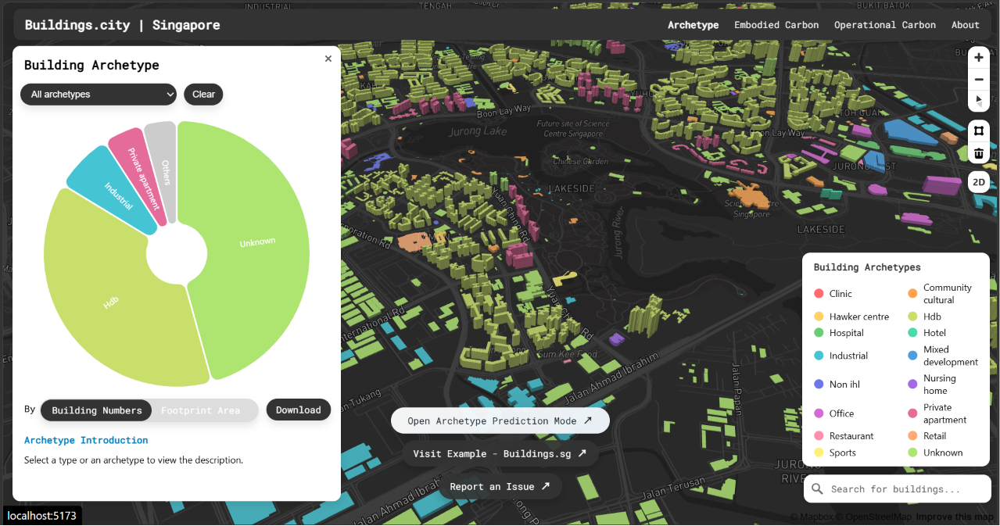
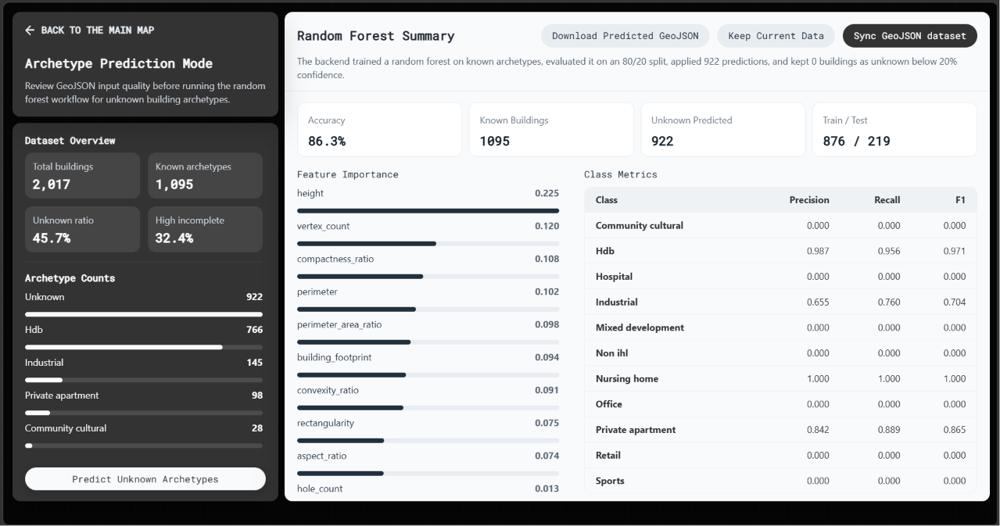
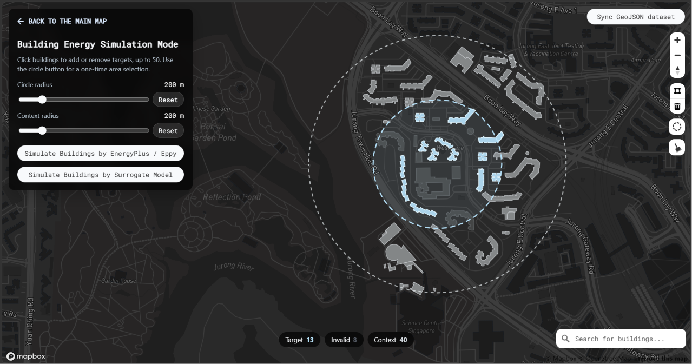

# Buildings.city Package V2.0

<br><br>

## 🏙️ What is Buildings.city?

Buildings.city helps cities, researchers, and urban energy teams turn their own building datasets into interactive Urban Building Energy Modeling (UBEM) applications.

With one GeoJSON file, users can:

- visualize building archetypes, energy metrics, and carbon metrics
- explore city-scale building patterns through maps, charts, popups, and area analysis
- predict missing building archetypes with a local ML API
- run EnergyPlus-based simulations with a local simulation API
- sync reviewed predictions, building edits, and simulation results back into the dataset

Buildings.city is local-first and configurable. The main app runs in the browser through a Vite-powered HTML/JavaScript frontend. Optional Python APIs add ML prediction and EnergyPlus workflows only when users need them. For most city deployments, users work mainly inside `user-data/`; the application code can stay unchanged.




<br><br>

## 🧭 System Architecture

Buildings.city V2.0 is organized as a local-first UBEM platform rather than a single map page.

```text
Active GeoJSON + config
        |
        v
Frontend web app
Mapbox + ECharts + Turf + Vite
        |
        +-- Main map
        +-- Archetype prediction mode
        `-- Building simulation mode
        |
        v
Optional local APIs
ML API on :8000 + Simulation API on :8010
        |
        v
Synced GeoJSON, templates, IDFs, SQL files, hourly outputs, and summaries
```

### Frontend Application

The frontend is a local multi-page web app:

- `index.html`: main map, archetype visualization, energy/carbon views, charts, popups, and drawing tools
- `archetype-prediction.html`: missing archetype diagnostics, ML prediction, and review workflow
- `energy-simulation.html`: building selection, simulation setup, result review, and sync workflow

### User Data Layer

Project-specific data lives in `user-data/`:

- `user-data/config.json`: city settings, Mapbox token, field mappings, service URLs, energy/carbon assumptions, and EnergyPlus paths
- `user-data/buildings/`: active building GeoJSON datasets
- `user-data/simulation/templates.json`: editable simulation template assumptions
- `user-data/simulation/weather/`: weather inputs for simulation

### Optional API Layer

The frontend can run on its own. Add the APIs when the project needs completion or simulation:

- ML API: predicts unknown building archetypes from partially labeled GeoJSON data.
- Simulation API: prepares geometry, templates, IDFs, EnergyPlus runs, SQL artifacts, hourly outputs, and simulation summaries.


<br><br>

## 🔁 Core Workflow

The main workflow is intentionally simple:

```text
GeoJSON -> Visualization -> Missing Archetype Prediction -> Simulation -> Sync Results Back
```

### 1. Load a GeoJSON Dataset

Place a city building dataset under `user-data/buildings/`, then point `user-data/config.json -> buildings_source.data` to it:

```json
"buildings_source": {
  "type": "geojson",
  "data": "/user-data/buildings/jld.geojson"
}
```

This active GeoJSON becomes the shared source for the map, charts, prediction page, and simulation page.

### 2. Visualize and Explore

The main map reads the active GeoJSON and config values to render building archetypes, energy/carbon views, EUI breakdowns, charts, selected-building popups, and area analysis.

This step only needs the frontend, a valid Mapbox token, and a valid GeoJSON file.

### 3. Complete Missing Archetypes

If some buildings have missing or `unknown` archetypes, the prediction mode sends the active GeoJSON to the ML API. The API trains on known examples, predicts missing labels, returns model diagnostics, and lets the user review the results before syncing.



### 4. Simulate Selected Buildings

The simulation mode uses the same active GeoJSON for target building selection and context shading. The simulation API resolves building geometry by stable IDs, applies archetype templates, prepares IDF files, runs EnergyPlus when configured, and returns summary, SQL, and hourly outputs.



### 5. Sync Results Back

Reviewed outputs can be written back to the active GeoJSON through the local Vite sync endpoint:

```text
POST /api/sync-geojson-dataset
```

The endpoint only writes to the currently configured `buildings_source.data` file. This keeps the data flow clear: the frontend reads the active GeoJSON, optional APIs return reviewed outputs, and accepted changes are synced back into the same working dataset.

Additional sync support:

- `POST /building-library/reload`: asks the simulation API to reload the updated GeoJSON after sync.
- `POST /idf-templates/sync`: updates an archetype template and regenerates IDFs.

Users do not need to manually copy results between separate files unless they want to keep backup versions.


<br><br>

## ✅ Before You Start

Start with the frontend first. It is the fastest way to confirm that the dataset, Mapbox token, and configuration are working. Add the ML API or Simulation API later when the workflow needs them.

| Need | Required For | Notes |
| --- | --- | --- |
| Node.js + npm | Frontend | Installs JavaScript dependencies and runs Vite. |
| Browser | Frontend | Chrome, Edge, Firefox, or Safari. |
| Mapbox token | Frontend | Set in `user-data/config.json -> mapbox_token`. |
| Python 3.10+ | ML API and Simulation API | Runs the local FastAPI services. |
| Python virtual environment | ML API and Simulation API | Created by `npm run ml:setup` and `npm run simulation:setup`. |
| EnergyPlus | Simulation API | Required only for EnergyPlus-backed simulation runs. |
| Weather ZIP | Simulation API | Default path: `user-data/simulation/weather/SGP_SG_Tengah.AP.486870_TMYx.zip`. |

A virtual environment keeps Python dependencies inside each service folder instead of mixing them with the system Python installation. This makes setup safer for beginners and easier to repeat across machines.

For EnergyPlus, update these paths in `user-data/config.json` if your installation is in a different location:

```json
"energyplus_executable_path": "D:\\energyplus\\...\\energyplus.exe",
"energyplus_idd_path": "D:\\energyplus\\...\\Energy+.idd"
```


<br><br>

## ⚡ Quick Start

### 1. Run the Frontend

```bash
npm install
npm run dev
```

Open the Vite URL, usually:

```text
http://localhost:5173
```

Useful pages:

- Main map: `http://localhost:5173/`
- Archetype prediction: `http://localhost:5173/archetype-prediction.html`
- Energy simulation: `http://localhost:5173/energy-simulation.html`

To use your own city data, place the GeoJSON in `user-data/buildings/` and update:

```text
user-data/config.json -> buildings_source.data
```

### 2. Run the ML API

Use this only for missing archetype prediction.

```bash
npm run ml:setup
npm run ml:start
```

Default URL:

```text
http://localhost:8000
```

Set or confirm:

```json
"ml_service_url": "http://localhost:8000",
"ml_archetype_property": "building_archetype"
```

Main endpoints:

- `GET /health`
- `POST /predict-archetypes/jobs`
- `GET /predict-archetypes/jobs/{job_id}`

### 3. Run the Simulation API

Use this only for EnergyPlus-backed simulation workflows.

```bash
npm run simulation:setup
npm run simulation:start
```

Default URL:

```text
http://localhost:8010
```

Main endpoints:

- `GET /health`
- `POST /simulation-jobs`
- `GET /simulation-jobs/{job_id}`
- `POST /building-library/reload`
- `POST /idf-templates/sync`

Required simulation inputs:

- active GeoJSON from `user-data/buildings/`
- `user-data/simulation/templates.json`
- EnergyPlus executable and IDD paths in `user-data/config.json`
- weather ZIP under `user-data/simulation/weather/`


<br><br>

## ⚙️ Configuration

Most project changes happen in:

```text
user-data/config.json
```

Important fields:

- `city_name`, `country`, `projectDescription`: project identity and About text
- `mapbox_token`, `map_style`: map access and basemap style
- `buildings_source.data`: active GeoJSON path
- `height_field`: building height field used by map, ML diagnostics, and simulation checks
- `ml_archetype_property`: archetype field used across visualization, ML, and simulation
- `operational_energy_data`: archetype energy intensity values
- `embodied_carbon_values`: archetype embodied carbon intensity values
- `archetype_descriptions`: text shown for selected archetypes
- `ml_service_url`: ML API URL, default `http://localhost:8000`
- `simulation_service_url`: simulation API URL, default `http://localhost:8010`
- `energyplus_executable_path`, `energyplus_idd_path`: local EnergyPlus paths

Editable data folders:

- `user-data/buildings/`: city GeoJSON files
- `user-data/simulation/templates.json`: archetype simulation templates
- `user-data/simulation/weather/`: weather files for simulation

Most users should not need to edit `src/`, `ml-service/`, or `simulation-service/` unless they are extending the platform.


### GeoJSON Requirements

The active dataset should be a valid GeoJSON `FeatureCollection` with `Polygon` or `MultiPolygon` building geometries.

Recommended properties:

- `building_archetype`: building type or archetype label
- `height`: building height in meters
- `building_levels`: number of floors, useful as a height fallback
- `building_footprint` or `footprint_area`: useful for diagnostics and ML features
- `gross_floor_area`: useful for energy and carbon calculations
- `building_id`, `id`, `simulation_uid`, `osm_id`, or `@id`: stable identifiers for sync and simulation lookup

Field names are case-sensitive. If your dataset uses different names, update the matching fields in `user-data/config.json`.


<br><br>

## 📁 Repository Structure

```text
buildings.city-package/
|-- user-data/
|   |-- config.json
|   |-- buildings/
|   `-- simulation/
|-- src/
|   |-- main.js
|   |-- mapbox.js
|   |-- archetype-prediction.js
|   |-- energy-simulation.js
|   |-- data-sync-api.js
|   |-- ml-api.js
|   `-- simulation-api.js
|-- ml-service/
|   `-- app/
|-- simulation-service/
|   |-- app/
|   |-- idf/
|   `-- results/
|-- index.html
|-- archetype-prediction.html
|-- energy-simulation.html
|-- package.json
`-- vite.config.js
```


<br><br>

## 🛠️ Common Checks

If the map is blank:

- Check the Mapbox token.
- Check that `buildings_source.data` points to an existing file under `user-data/buildings/`.
- Check that the GeoJSON is valid and contains polygon building features.

If archetype charts are empty:

- Check that the GeoJSON contains the configured archetype field.
- Check that archetype values are not all empty or `unknown`.

If sync fails:

- Confirm the frontend is running with `npm run dev`.
- Confirm the sync target is exactly the active `buildings_source.data` path.
- Keep a backup of important datasets before syncing generated results.

If ML prediction fails:

- Confirm `npm run ml:start` is running.
- Confirm `ml_service_url` points to the ML API, not the frontend.
- Confirm the dataset has enough known archetypes and at least two known classes.

If simulation fails:

- Confirm `npm run simulation:start` is running.
- Confirm `simulation_service_url` points to the simulation API.
- Confirm EnergyPlus paths in `user-data/config.json` are correct.
- Confirm the weather ZIP and `templates.json` are available.
- If geometry lookup fails after changing GeoJSON, call `/building-library/reload` or restart the simulation API.


<br><br>

## 🔗 Resources

Project website: https://buildings.city

Source repository: https://github.com/City-Syntax/buildings.city
